# Riftline

[](https://github.com/jeffreyroger/riftline-cli/actions/workflows/ci.yml)

**If I change this function, what else breaks?**

## The problem

You're about to edit a function. Somewhere else in the codebase — maybe
three files away, maybe through a re-export you forgot existed — something
calls it. `grep` finds text matches, not call graphs; it can't tell you
that `core.compute()` is reached through `app.run()` through a chain of
imports, or that a git diff touching two functions has a caller in common
between them. Riftline parses your package into a function-level dependency
graph and answers that question directly, before you touch the code —
either by naming a function, by scanning for the riskiest chokepoints, or
by pointing it at a git diff.

## Install

```bash
pip install .
```

This installs the `riftline-cli` distribution (importable as `riftline`)
and exposes a `riftline` console command on your `PATH`. For local
development, use an editable install with the `dev` extra so edits take
effect immediately and the test tooling (`pytest`, `hypothesis`) comes
along with it:

```bash
pip install -e ".[dev]"
```

Verify with (real output, captured from a fresh virtualenv outside the
repo):

```
$ riftline --version
riftline 0.1.0
$ riftline --help
 Usage: riftline [OPTIONS] COMMAND [ARGS]...

 Know what breaks before you break it.

+- Options -------------------------------------------------------------------+
| --version          Show the installed version and exit.                     |
| --help             Show this message and exit.                              |
+-----------------------------------------------------------------------------+
+- Commands ------------------------------------------------------------------+
| scan      Parse a package and print a graph summary.                        |
| hotspots  Rank every function by blast-radius size. No symbol name needed.  |
| impact    Show what breaks if SYMBOL changes.                               |
| export    Serialize the current graph to Mermaid, DOT, or JSON for          |
|           visualization.                                                    |
| diff      Map a git diff to changed functions and (optionally) their blast  |
|           radius.                                                           |
+-----------------------------------------------------------------------------+
```

## Quickstart

Output is rendered with [Rich](https://github.com/Textualize/rich): tables
for `hotspots`/`impact`, resolved edge counts in blue, unresolved in red.
When stdout isn't a terminal (piped, or captured by a test), Rich degrades
to plain ASCII automatically — every block below is real captured output,
not a mockup.

### `riftline scan` — graph summary

```
$ riftline scan fixtures/mini_pkg
Scanned: C:\riftline\fixtures\mini_pkg
  functions found : 4
  edges resolved  : 3
  edges unresolved: 1  (flagged, not guessed)
```

### `riftline hotspots` — riskiest functions, no symbol name needed

```
$ riftline hotspots fixtures/mini_pkg --limit 4
      Top 4 riskiest functions in
   C:\riftline\fixtures\mini_pkg (by
           blast-radius size)
+--------------------------------------+
| Function                | Dependents |
|-------------------------+------------|
| mini_pkg.core.low_level |          3 |
| mini_pkg.utils.helper   |          2 |
| mini_pkg.main.foo       |          1 |
+--------------------------------------+
```

`core.low_level` is 3 hops from `app.run` with no direct import — the graph
traces the full chain anyway.

### `riftline impact` — blast radius of a single named function

Short names auto-resolve if unambiguous:

```
$ riftline impact low_level --path fixtures/mini_pkg
(matched 'low_level' -> mini_pkg.core.low_level)
     Blast radius of
 mini_pkg.core.low_level
+-----------------------+
| Dependent function    |
|-----------------------|
| mini_pkg.app.run      |
| mini_pkg.main.foo     |
| mini_pkg.utils.helper |
+-----------------------+
```

If a short name matches more than one function, every match is listed and
the command exits non-zero rather than guessing which one you meant:

```
$ riftline impact helper --path fixtures
'helper' is ambiguous -- 2 functions match:
  - mini_pkg.utils.helper
  - reexport_pkg.subpkg.utils.helper
Re-run with one of the full names above.
```

### `riftline export` — serialize the graph

```
$ riftline export --format json --path fixtures/mini_pkg
```
```json
{
  "nodes": [
    { "id": "mini_pkg.app.run", "label": "mini_pkg.app.run" },
    { "id": "mini_pkg.core.low_level", "label": "mini_pkg.core.low_level" },
    { "id": "mini_pkg.main.foo", "label": "mini_pkg.main.foo" },
    { "id": "mini_pkg.utils.helper", "label": "mini_pkg.utils.helper" },
    { "id": "unknown:bar", "label": "unknown:bar" }
  ],
  "edges": [
    { "source": "mini_pkg.app.run", "target": "mini_pkg.main.foo", "confidence": "resolved" },
    { "source": "mini_pkg.main.foo", "target": "mini_pkg.utils.helper", "confidence": "resolved" },
    { "source": "mini_pkg.main.foo", "target": "unknown:bar", "confidence": "unresolved" },
    { "source": "mini_pkg.utils.helper", "target": "mini_pkg.core.low_level", "confidence": "resolved" }
  ]
}
```

`--format dot` and `--format mermaid` are also available (see [How it
works](#how-it-works) below for a real Mermaid example).

## The killer example: blast radius of a git diff

This is the tool's primary intended workflow (SRS FR-10): point it at two
git refs and get back the merged, deduplicated blast radius of every
function that changed between them — not per-function, one union.

Real run against a small real git repo built for this README (two commits;
the second commit edits **two** functions, `a()` and `b()`, that share a
common downstream caller) — `demopkg-repo` below is that repo, in a scratch
directory outside this project:

```
$ riftline diff HEAD~1 HEAD --path demopkg-repo
(changed functions: demopkg.core.a, demopkg.core.b)
Blast radius of changed functions between HEAD~1 and HEAD:
  - demopkg.app.run_a
  - demopkg.app.run_b
  - demopkg.main.entry

Possible related tests (unverified, naming-convention only):
  - no matching test file found
```

`demopkg.main.entry` calls both `run_a()` and `run_b()`, so it's a
dependent of *both* changed functions — it appears in this list exactly
once, not twice. That's `merged_blast_radius()`: the union of each
changed function's individual blast radius, deduplicated, so a diff
touching several related functions doesn't drown you in the same
downstream name repeated over and over.

Every failure mode along the way is a specific message and a non-zero exit
code, never a silent wrong answer:

```
# Bad path
Error: path does not exist: C:\Program Files\Git\nonexistent
Check for a typo, or run 'dir' (Windows) / 'ls' (Mac/Linux) to see what's actually there.

# Non-git directory
Error: 'C:\Users\...\plain_dir_no_git' is not inside a git repository.
  Make sure the path points at a git-tracked project (look for a .git folder in the directory or its parents).

# Bad ref
Error: git ref 'mybranch' does not exist in the repository at '...\demopkg-repo'.
  Run 'git log --oneline' to see valid commits, or 'git branch -a' for branch names.
```

## How it works

Riftline scanning itself, generated by `riftline export --format mermaid`
run against Riftline's own source — this is the self-analysis story, not
a hand-drawn architecture sketch. The full self-scan (69 functions, 97
resolved / 240 unresolved edges) is checked in at
[docs/self-scan.mmd](docs/self-scan.mmd); the diagram below is the real
cross-module subset of that same output (same node/edge lines, filtered
down to edges that cross a file boundary, for legibility). Node IDs carry
a short hash suffix — that's `export.py`'s own collision-proofing so two
differently-named functions never get merged into one diagram node:

```mermaid
flowchart TD
    riftline_cli__print_test_suggestions_cba65ec7["cli._print_test_suggestions"]
    riftline_cli__resolve_symbol_or_exit_6bdf1771["cli._resolve_symbol_or_exit"]
    riftline_cli__validated_root_a23f8336["cli._validated_root"]
    riftline_cli_cmd_diff_4f27d4fc["cli.cmd_diff"]
    riftline_cli_cmd_export_7590097b["cli.cmd_export"]
    riftline_cli_cmd_hotspots_1acbf4d7["cli.cmd_hotspots"]
    riftline_cli_cmd_impact_69c638e2["cli.cmd_impact"]
    riftline_cli_cmd_scan_00f2c969["cli.cmd_scan"]
    riftline_export_to_dot_5ec271c3["export.to_dot"]
    riftline_export_to_json_dd1077d3["export.to_json"]
    riftline_export_to_mermaid_b1aae001["export.to_mermaid"]
    riftline_git_diff__assert_git_repo_f8e68240["git_diff._assert_git_repo"]
    riftline_git_diff_find_changed_functions_b5dcdae8["git_diff.find_changed_functions"]
    riftline_graph_blast_radius_0915210a["graph.blast_radius"]
    riftline_graph_build_graph_84f9fe8d["graph.build_graph"]
    riftline_graph_find_python_files_dbb8ae7f["graph.find_python_files"]
    riftline_graph_find_symbol_4237300b["graph.find_symbol"]
    riftline_graph_hotspots_cfd5e891["graph.hotspots"]
    riftline_graph_merged_blast_radius_510cdbee["graph.merged_blast_radius"]
    riftline_graph_real_nodes_bb4cbc18["graph.real_nodes"]
    riftline_parser_clear_parse_failures_9bd3da8d["parser.clear_parse_failures"]
    riftline_parser_get_parse_failures_02540665["parser.get_parse_failures"]
    riftline_parser_parse_a23fde01["parser.parse"]
    riftline_resolver_build_class_method_table_4c06dc4b["resolver.build_class_method_table"]
    riftline_resolver_module_name_for_file_7d08df42["resolver.module_name_for_file"]
    riftline_resolver_resolve_calls_for_file_050ea29e["resolver.resolve_calls_for_file"]
    riftline_testmapper_suggest_test_file_b91a9574["testmapper.suggest_test_file"]
    riftline_cli__print_test_suggestions_cba65ec7 --> riftline_testmapper_suggest_test_file_b91a9574
    riftline_cli__resolve_symbol_or_exit_6bdf1771 --> riftline_graph_find_symbol_4237300b
    riftline_cli__validated_root_a23f8336 --> riftline_graph_find_python_files_dbb8ae7f
    riftline_cli_cmd_diff_4f27d4fc --> riftline_git_diff__assert_git_repo_f8e68240
    riftline_cli_cmd_diff_4f27d4fc --> riftline_git_diff_find_changed_functions_b5dcdae8
    riftline_cli_cmd_diff_4f27d4fc --> riftline_graph_build_graph_84f9fe8d
    riftline_cli_cmd_diff_4f27d4fc --> riftline_graph_merged_blast_radius_510cdbee
    riftline_cli_cmd_diff_4f27d4fc --> riftline_parser_clear_parse_failures_9bd3da8d
    riftline_cli_cmd_diff_4f27d4fc --> riftline_parser_get_parse_failures_02540665
    riftline_cli_cmd_export_7590097b --> riftline_export_to_dot_5ec271c3
    riftline_cli_cmd_export_7590097b --> riftline_export_to_json_dd1077d3
    riftline_cli_cmd_export_7590097b --> riftline_export_to_mermaid_b1aae001
    riftline_cli_cmd_export_7590097b --> riftline_graph_build_graph_84f9fe8d
    riftline_cli_cmd_export_7590097b --> riftline_parser_clear_parse_failures_9bd3da8d
    riftline_cli_cmd_hotspots_1acbf4d7 --> riftline_graph_build_graph_84f9fe8d
    riftline_cli_cmd_hotspots_1acbf4d7 --> riftline_graph_hotspots_cfd5e891
    riftline_cli_cmd_hotspots_1acbf4d7 --> riftline_parser_clear_parse_failures_9bd3da8d
    riftline_cli_cmd_hotspots_1acbf4d7 --> riftline_parser_get_parse_failures_02540665
    riftline_cli_cmd_impact_69c638e2 --> riftline_graph_blast_radius_0915210a
    riftline_cli_cmd_impact_69c638e2 --> riftline_graph_build_graph_84f9fe8d
    riftline_cli_cmd_impact_69c638e2 --> riftline_parser_clear_parse_failures_9bd3da8d
    riftline_cli_cmd_impact_69c638e2 --> riftline_parser_get_parse_failures_02540665
    riftline_cli_cmd_scan_00f2c969 --> riftline_graph_build_graph_84f9fe8d
    riftline_cli_cmd_scan_00f2c969 --> riftline_graph_real_nodes_bb4cbc18
    riftline_cli_cmd_scan_00f2c969 --> riftline_parser_clear_parse_failures_9bd3da8d
    riftline_cli_cmd_scan_00f2c969 --> riftline_parser_get_parse_failures_02540665
    riftline_git_diff_find_changed_functions_b5dcdae8 --> riftline_parser_parse_a23fde01
    riftline_graph_build_graph_84f9fe8d --> riftline_parser_parse_a23fde01
    riftline_graph_build_graph_84f9fe8d --> riftline_resolver_build_class_method_table_4c06dc4b
    riftline_graph_build_graph_84f9fe8d --> riftline_resolver_module_name_for_file_7d08df42
    riftline_graph_build_graph_84f9fe8d --> riftline_resolver_resolve_calls_for_file_050ea29e
```



Notice what's absent: no arrow points from `graph.*` or `resolver.*` into
`cli.*`. That's not a diagram-drawing choice — it's the graph Riftline
generated from its own source, and it's the empirical check for NFR-5
(layer independence): the resolution engine must never depend on the CLI
layer, and this run confirms it doesn't.

In prose: four layers, each depending only on the output types of the
layer below. `parser.py` walks the AST of each file (imports, function
defs, calls); `resolver.py` chains each file's import table against every
other file's symbol table to turn a raw call name into a resolved edge or
an explicit `unknown:` node — never a guess; `graph.py` assembles those
edges into a `networkx.DiGraph` and answers blast-radius/hotspot/symbol
queries against it; `cli.py` is the only layer that knows about Typer,
Rich, or the terminal, and it depends on the three below it, never the
other way around. `git_diff.py` sits beside `cli.py` as a second consumer
of `graph.py`, mapping a `git diff` to the set of changed functions.

## What it deliberately does NOT do

Riftline's guiding principle (SRS §1.4) is **never present a guess as a
fact**. Every one of the following is a considered design boundary, not a
bug waiting to be filed:

- **Third-party / cross-package calls always resolve as `unknown:<name>`.**
  Riftline only reasons about code it can actually see; it will not guess
  what an installed dependency's internals do.
- **Multiple inheritance is flagged, not guessed.** If `self.method()`
  could resolve to more than one base class's implementation, the edge is
  `unresolved` with an explicit "ambiguous across multiple base classes"
  reason — never silently picked as "the first match."
- **Dynamic attribute targets are flagged, not guessed.**
  `self.attr.method()` and calls through untyped/unannotated variables stay
  `unresolved` rather than being resolved by assumption.
- **Star imports (`from .submodule import *`) are not resolved
  statically.** Names entering scope through a star import are flagged
  `unresolved` rather than exhaustively (and speculatively) expanded.
- **Git change detection is line-range based, not semantic.** `riftline
  diff` maps changed *lines* to the function whose span contains them; it
  does not understand that a change is a no-op, a rename, or semantically
  equivalent to the old code — if the lines inside a function's span
  changed, the function is "changed."
- **Python only.** The parser is Python's own `ast` module. This is a
  deliberate v1 decision (see [Implementation
  substitutions](#implementation-substitutions) below), not a
  not-yet-built feature.
- **No dynamic or runtime analysis, ever.** Riftline is purely static —
  it never imports, executes, or instruments the code it scans.

## Benchmark

Real-world scan against [scrapy/scrapy](https://github.com/scrapy/scrapy)
(446 files, BSD-3-Clause), full write-up in
[docs/benchmark-results.md](docs/benchmark-results.md). Numbers below are
exactly as measured, not rounded in the tool's favor:

| Metric | Result |
|---|---|
| Files scanned | 446 |
| Functions found | 8,876 |
| Edges resolved | 4,616 |
| Edges unresolved | 12,511 |
| Scan time (core `build_graph`) | ~2.4s |
| Scan time (full CLI) | ~3.07s |
| Resolved-edge sample false-positive rate (n=15) | **0/15 (0%)** |
| Unresolved-edge sample false-negative rate (n=15) | **1/15 (~6.7%)** — confirmed systemic: 26 occurrences of the same root cause in one file, not a one-off |
| Resolved edges missing file/lineno metadata (full corpus) | 965/4,616 (20.9%) — a known, documented gap, not silently hidden |

The false-negative and the metadata gap are both open, named findings
(Finding 1 and Finding 2 in the full report) — reported honestly rather
than fixed quietly or left out of this README.

## Test fixtures

| Fixture | Purpose |
|---|---|
| `fixtures/mini_pkg/` | 4-file chain (`app→main→utils→core`), one unresolved call — regression baseline, never modified |
| `fixtures/oop_pkg/` | OOP: `self.foo()` resolution, single-inheritance chains, dynamic-attribute unresolved cases |
| `fixtures/diff_repo/` | Ephemeral — built and torn down by `tests/test_diff.py`; committed tree contains only `.gitkeep` |
| `fixtures/testmapped_pkg/` | `core.py` has a matching `tests/test_core.py` (positive case); `orphan.py` has no matching test file (negative case) — backs the test-file suggestion heuristic |

## Running the tests

```bash
pip install -e ".[dev]"
pytest tests/ -v
```

Current count: **56 tests, all passing** (54 migrated 1:1 from the prior
`unittest` suite, plus 2 `hypothesis` property-based tests covering
generated relative-import depths and package-nesting depths).

## Implementation substitutions

One stdlib stand-in remains, deliberately; both others have been reversed:

| Planned | Using instead | Scope | Status |
|---|---|---|---|
| `tree-sitter` | `ast` (stdlib) | `parser.py` only | **Kept — not reversing.** Reversing this would violate the requirement that the core stay offline-buildable with zero third-party dependencies beyond `networkx`, for multi-language support that's explicitly out of scope for v1. |

`typer` + `rich` (CLI framework/output) and `pytest` (+ `hypothesis` for
property-based tests) have both been reversed — confined to `cli.py` and
`tests/`+`dev` extra respectively. `parser.py`, `resolver.py`, and
`graph.py` still import nothing beyond `networkx`.

## Demo transcript

No terminal-recording tool (asciinema, ttygif, terminalizer, ...) is
available in this environment, so instead of a fabricated GIF, here is a
**real, unedited terminal transcript** of the quickstart flow run
end-to-end in one sitting. Every line below is genuine captured stdout —
nothing here was written by hand and then dressed up as a terminal
session.

```
$ riftline scan fixtures/mini_pkg
Scanned: C:\riftline\fixtures\mini_pkg
  functions found : 4
  edges resolved  : 3
  edges unresolved: 1  (flagged, not guessed)

$ riftline hotspots fixtures/mini_pkg --limit 4
      Top 4 riskiest functions in
   C:\riftline\fixtures\mini_pkg (by
           blast-radius size)
+--------------------------------------+
| Function                | Dependents |
|-------------------------+------------|
| mini_pkg.core.low_level |          3 |
| mini_pkg.utils.helper   |          2 |
| mini_pkg.main.foo       |          1 |
+--------------------------------------+

$ riftline impact low_level --path fixtures/mini_pkg
(matched 'low_level' -> mini_pkg.core.low_level)
     Blast radius of
 mini_pkg.core.low_level
+-----------------------+
| Dependent function    |
|-----------------------|
| mini_pkg.app.run      |
| mini_pkg.main.foo     |
| mini_pkg.utils.helper |
+-----------------------+

Possible related tests (unverified, naming-convention only):
  - no matching test file found

$ riftline diff HEAD~1 HEAD --path demopkg-repo
(changed functions: demopkg.core.a, demopkg.core.b)
Blast radius of changed functions between HEAD~1 and HEAD:
  - demopkg.app.run_a
  - demopkg.app.run_b
  - demopkg.main.entry

Possible related tests (unverified, naming-convention only):
  - no matching test file found
```
